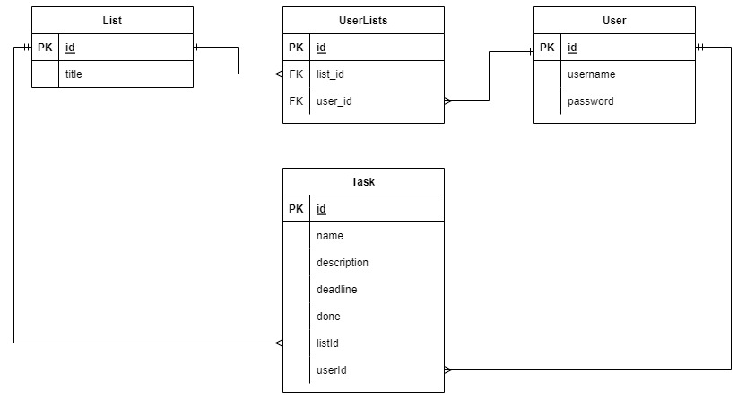

# ToDoApp

ToDoApp API is created with ExpressJS with Typescript and SQL database MySQL. ORM Sequelize is use to connect and work with database.  

## Installation

Download the code. In config.json change user and password for connect to mysql database. Then you type: 

```bash
npm start
```

## Database Schema


## Application functionality
- Registration, login, authentication with jwt token
- Creating lists with title only logged user
- Adding tasks to list only logged users linked to the list
- Task contain a title, free text, deadline, info about who created the record
- Chage tasks to done (only for users linked to the list)
- View all lists and items for anyone, even not logged in
- Sharing the list with other users (only users linked to the list)


## API documentation

Swagger documentation [here](https://app.swaggerhub.com/apis-docs/MarianChoma/ToDoApp/1.0.0)
